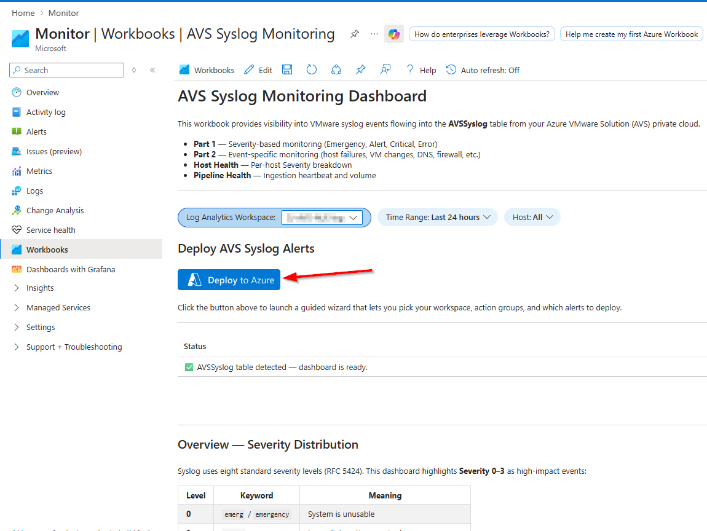

# AVS Syslog Monitoring — Workbook & Alerts

Pre-built Azure Monitor **Workbook** and **14 alert rules** for monitoring [Azure VMware Solution (AVS)](https://learn.microsoft.com/en-us/azure/azure-vmware/) syslog events. Everything runs against the `AVSSyslog` Log Analytics table.

---

## Prerequisites

| Requirement | Details |
|---|---|
| **AVS private cloud** | With a [Diagnostic Setting](https://learn.microsoft.com/en-us/azure/azure-vmware/configure-vmware-syslogs) that sends the **Syslog** category to a Log Analytics workspace. |
| **Log Analytics workspace** | The workspace that receives `AVSSyslog` data. |
| **Action Group(s)** | At least one [Action Group](https://learn.microsoft.com/en-us/azure/azure-monitor/alerts/action-groups) for alert notifications. Required only for alert deployment. |

### Configure AVS Syslog Forwarding

Before deploying, your AVS private cloud must be sending syslog data to a Log Analytics workspace:

1. In the Azure portal, navigate to your **Azure VMware Solution** private cloud.
2. Go to **Diagnostic settings** → **+ Add diagnostic setting**.
3. Check the **VMware Syslog** category (this includes vCenter, ESXi, vSAN, NSX, and firewall logs).
4. Under **Destination details**, select **Send to Log Analytics workspace** and choose your workspace.
5. Click **Save**.

Verify data is flowing after a few minutes:

```kql
AVSSyslog
| take 10
```

> For full details, see [Configure VMware syslogs for Azure VMware Solution](https://learn.microsoft.com/en-us/azure/azure-vmware/configure-vmware-syslogs).

---

## 1. Deploy the Workbook

The workbook gives you real-time dashboards for severity distribution, event-specific monitoring, host health, and pipeline status — start here.

### Option A — One-click Deploy

[](https://portal.azure.com/#create/Microsoft.Template/uri/https%3A%2F%2Fraw.githubusercontent.com%2Fbrenmelo%2Favs-syslog-monitoring%2Fmain%2Favs-syslog-workbook-deploy-template.json)

1. Click the button above.
2. Select your **Subscription** and **Resource Group**.
3. Optionally change the workbook display name (default: `AVS Syslog Monitoring`).
4. Click **Review + create** → **Create**.
5. Open the workbook and select your **Log Analytics workspace** from the dropdown inside.

### Option B — Manual Import (Azure Portal)

1. Go to **Monitor → Workbooks → + New**.
2. Click the **Advanced Editor** icon (`</>`).
3. Delete any existing JSON in the editor.
4. Paste the full contents of [`avs-syslog-workbook-gallery.json`](avs-syslog-workbook-gallery.json).
5. Click **Apply**.
6. Click **Save** (or **Save As**), choose your resource group and location.

### Option C — Azure CLI

```bash
# Deploy the workbook ARM template
az deployment group create \
  --resource-group <your-rg> \
  --template-file avs-syslog-workbook-deploy-template.json
```

### Workbook Sections

Once deployed, the workbook includes:

| Section | What It Shows |
|---|---|
| **Overview** | Severity distribution tiles, pie chart, top event sources by AppName |
| **Part 1 — Severity-Based** | Time series and detail grids for Emergency, Alert, Critical, Error events |
| **Part 2 — Event-Specific** | Summary tiles and grids for host failures, VM changes, DNS, DFW, maintenance, role changes |
| **Host Health Overview** | Per-host heatmap and trend of high-impact events |
| **Data Pipeline Health** | Syslog ingestion heartbeat tile and volume chart |

---

## 2. Deploy the Alert Rules

### Before You Begin — Create an Action Group

Alert rules require at least one **Action Group** to define who gets notified and how. If you don't have one yet, create one before deploying alerts.

**Create an Action Group:** Go to **Monitor → Alerts → Action groups → + Create**.

| Notification Type | Use Case | Setup |
|---|---|---|
| **Email** | Direct email to on-call engineers or distribution lists | Add email addresses under the **Notifications** tab |
| **SMS** | Urgent alerts to mobile phones | Add phone numbers under **Notifications** |
| **Azure mobile app** | Push notifications to the Azure app on your phone | Enable under **Notifications** → Azure app push |
| **Voice call** | Phone call for critical after-hours alerts | Add phone numbers under **Notifications** |
| **Microsoft Teams** | Post alerts to a Teams channel for team visibility | Under **Actions** → select **Microsoft Teams** and pick the channel ([docs](https://learn.microsoft.com/en-us/azure/azure-monitor/alerts/action-groups#microsoft-teams)) |
| **Webhook** | Integrate with ticketing systems (ServiceNow, PagerDuty, Jira, etc.) | Under **Actions** → add a **Webhook** with the endpoint URL from your ITSM tool |
| **ITSM Connector** | Bi-directional integration with ServiceNow, System Center, etc. | Under **Actions** → select **ITSM** ([docs](https://learn.microsoft.com/en-us/azure/azure-monitor/alerts/itsmc-overview)) |
| **Logic App** | Custom workflows — auto-create tickets, enrich alerts, notify Slack, etc. | Under **Actions** → select **Logic App** and choose your workflow |
| **Azure Function** | Run custom code on alert (e.g., auto-remediation scripts) | Under **Actions** → select **Azure Function** |
| **Automation Runbook** | Execute PowerShell/Python runbooks for automated response | Under **Actions** → select **Automation Runbook** |

**Recommended strategy for AVS syslog monitoring:**

- **Minimum setup** — One action group with email notifications, used across all severity tiers.
- **Tiered setup** — Three action groups (one per severity tier) with escalating urgency:
  - **Sev 0** (Emergency/Alert/Host-down/Heartbeat) → Email + SMS + Voice call + Teams channel
  - **Sev 1** (Critical/VM/DNS/Role changes) → Email + Teams channel
  - **Sev 2** (Error/DFW/Maintenance/Guest Reboot) → Email only (or Teams)
- **Enterprise setup** — Action groups with webhook or ITSM integration to automatically create tickets in ServiceNow, PagerDuty, or Jira. Use Logic Apps for custom enrichment workflows (e.g., auto-tagging, Slack notifications, or runbooks for automated response).

> **Reference:** [Create and manage action groups](https://learn.microsoft.com/en-us/azure/azure-monitor/alerts/action-groups) | [IT Service Management Connector](https://learn.microsoft.com/en-us/azure/azure-monitor/alerts/itsmc-overview)

### Option A — Deploy from the Workbook (recommended)

If you deployed the workbook in Step 1, open it and click the **Deploy to Azure** button at the top of the workbook:



1. Open your deployed workbook: **Monitor → Workbooks → AVS Syslog Monitoring**.
2. Click the **Deploy to Azure** button shown above.
3. A guided wizard walks you through:
   - **Basics** — Subscription, resource group, Log Analytics workspace.
   - **Action Groups** — Select existing action groups from dropdowns for Severity 0, 1, and 2 (leave empty to skip a tier).
   - **Select Alerts** — Check or uncheck each of the 14 alert rules.
   - **Thresholds** — Sliders for volume-based alerts (Error, DNS, DFW).
4. Click **Review + create** → **Create**.

### Option B — One-click Deploy (standalone)

[](https://portal.azure.com/#create/Microsoft.Template/uri/https%3A%2F%2Fraw.githubusercontent.com%2Fbrenmelo%2Favs-syslog-monitoring%2Fmain%2Favs-syslog-alerts-deploy-template.json/createUIDefinitionUri/https%3A%2F%2Fraw.githubusercontent.com%2Fbrenmelo%2Favs-syslog-monitoring%2Fmain%2FcreateUiDefinition.json)

1. Click the button above (opens the same wizard directly without needing the workbook).
2. Follow the same guided wizard steps as Option A.
3. Click **Review + create** → **Create**.

### Option C — Azure CLI (all alerts at once)

```bash
az deployment group create \
  --resource-group <your-rg> \
  --template-file avs-syslog-alerts-deploy-template.json \
  --parameters workspaceResourceId="<workspace-resource-id>" \
               actionGroupIdSev0="<action-group-resource-id>" \
               actionGroupIdSev1="<action-group-resource-id>" \
               actionGroupIdSev2="<action-group-resource-id>"
```

### Option D — Manual Alert Creation (Azure Portal)

Create individual alert rules from **Monitor → Alerts → + Create → Alert rule**:

1. **Scope** — Select your Log Analytics workspace.
2. **Condition** — Choose **Custom log search**, paste the KQL query from the table below.
3. **Measurement** — Aggregation type: **Count**, Threshold: as noted.
4. **Evaluation** — Check every **5 minutes**, lookback period **15 minutes** (30 min for Heartbeat).
5. **Actions** — Attach your Action Group.
6. **Details** — Set the name, severity, and description.
7. **Review + create**.

Repeat for each alert you want. The full KQL queries are listed below.

---

## 3. Deploy Azure Service Health Alerts (recommended)

Syslog alerts monitor what's happening **inside** your AVS environment. Azure Service Health alerts monitor what **Microsoft is doing** — service outages, planned maintenance (ESXi/vCenter/NSX upgrades), health advisories, and security advisories (VMSAs, CVEs). Both are needed for complete monitoring.

### Why Service Health Alerts Matter for AVS

Microsoft is responsible for patching, upgrading, and maintaining the AVS infrastructure ([shared responsibility](https://learn.microsoft.com/en-us/azure/cloud-adoption-framework/scenarios/azure-vmware/manage)). Service Health is how Microsoft communicates:

- **Service Issues** — Outages or degradations affecting your private cloud
- **Planned Maintenance** — ESXi, vCenter, NSX, and vSAN upgrades (may cause brief VM connectivity interruptions during NSX upgrades)
- **Health Advisories** — Actions recommended (e.g., enable compression, update VMware Tools)
- **Security Advisories** — VMSAs and CVEs affecting AVS (e.g., VMSA-2025-0013, CVE-2025-22224)

Many items in the [Azure VMware Solution known issues](https://learn.microsoft.com/en-us/azure/azure-vmware/azure-vmware-solution-known-issues) page are first communicated via Service Health.

### Option A — One-click Deploy

[](https://portal.azure.com/#create/Microsoft.Template/uri/https%3A%2F%2Fraw.githubusercontent.com%2Fbrenmelo%2Favs-syslog-monitoring%2Fmain%2Favs-service-health-alert-template.json/createUIDefinitionUri/https%3A%2F%2Fraw.githubusercontent.com%2Fbrenmelo%2Favs-syslog-monitoring%2Fmain%2FcreateUiDefinition-service-health.json)

1. Click the button above.
2. Select your **Subscription** and **Resource Group**.
3. Select an **existing action group** from the dropdown (create one first if needed — see [Section 2](#before-you-begin--create-an-action-group)).
4. Check or uncheck which notification types to monitor (all enabled by default):
   - Service Issues
   - Planned Maintenance
   - Health Advisories
   - Security Advisories
5. Click **Review + create** → **Create**.

### Option B — Azure Portal (manual)

1. Go to **Monitor → Service Health → Health alerts → + Create activity log alert**.
2. Under **Scope**, select your subscription.
3. Under **Condition**:
   - **Services** → select **Azure VMware Solution**
   - **Event types** → check all: Service issue, Planned maintenance, Health advisory, Security advisory
4. Under **Actions**, select or create an action group.
5. Under **Details**, name the alert (e.g., `AVS-ServiceHealth-Alert`).
6. Click **Review + create** → **Create**.

### Option C — Azure CLI

```bash
# Create a Service Health alert for AVS service issues
az monitor activity-log alert create \
  --name "AVS-ServiceHealth-ServiceIssues" \
  --resource-group <your-rg> \
  --condition category=ServiceHealth \
  --condition-service "Azure VMware Solution" \
  --action-group <action-group-resource-id> \
  --description "AVS service issue alert"
```

> **Reference:** [Create Service Health alerts using ARM template](https://learn.microsoft.com/en-us/azure/service-health/alerts-activity-log-service-notifications-arm) | [Create Service Health alerts using the Azure portal](https://learn.microsoft.com/en-us/azure/service-health/alerts-activity-log-service-notifications-portal)

---

## Alert Rules Reference

### Evaluation Window & Frequency

All alert rules use an **evaluation frequency of 5 minutes** with a **lookback window of 15 minutes** (except the Ingestion Heartbeat alert, which uses a 30-minute window). These are the same values used by the **Deploy to Azure** button — no adjustment is needed after deployment.

**Why 15 minutes?**
- A 15-minute window with a 5-minute evaluation frequency means each check scans the last 15 minutes of data. This provides three overlapping evaluation cycles per window, which reduces the chance of missing a transient event that arrives near an evaluation boundary.
- It also smooths out short bursts — a single stray error won't immediately trigger threshold-based alerts (Error, DNS, DFW), but a sustained pattern within 15 minutes will.
- The Heartbeat alert uses 30 minutes because brief ingestion delays (a few minutes) are normal; only a prolonged gap signals a real pipeline problem.

**Why not a shorter window (e.g. 1 or 5 minutes)?**
- AVS syslog data flows through multiple stages before it becomes queryable: AVS private cloud → Diagnostic Setting → Log Analytics ingestion pipeline → `AVSSyslog` table. This typically takes **3–10 minutes**, depending on the Azure services involved ([Microsoft documentation](https://learn.microsoft.com/en-us/azure/azure-monitor/logs/data-ingestion-time#factors-affecting-latency)).
- A 1-minute window would scan a time range where the data hasn't arrived yet, causing **missed alerts**.
- A 5-minute window works in ideal conditions but leaves no buffer for ingestion delays — if data takes 6 minutes to arrive, the event falls outside the window.
- The 15-minute window is resilient to the full documented ingestion latency range, with no downside for `> 0` threshold alerts. **Detection speed is controlled by the 5-minute frequency, not the window** — the window only affects how far back each evaluation scans.

**Should you adjust it?**
- For most environments, the defaults work well. You can adjust them after deployment in **Monitor → Alerts → Alert rules → Edit**:
  - **Shorter window (e.g. 5 min)** — Faster alerting, but more sensitive to noise and one-off spikes.
  - **Longer window (e.g. 30 min)** — More tolerant of transient spikes, but slower to detect sustained issues.
- If you create alerts manually (Option D), use the values in the tables below, or adjust to match your operational requirements.

### Understanding Syslog Severity Levels

Syslog uses eight standard severity levels defined in [RFC 5424](https://datatracker.ietf.org/doc/html/rfc5424#section-6.2.1). This solution focuses on **Severity 0–3** as high-impact events that warrant alerting:

| Level | Keyword | Meaning | Examples | Alerting Strategy |
|:---:|---|---|---|---|
| **0** | `emerg` / `emergency` | System is unusable | Kernel panic, complete storage failure, host PSOD | **Alert immediately** — any occurrence |
| **1** | `alert` | Immediate action required | Hardware failure requiring replacement, HA failover triggered | **Alert immediately** — any occurrence |
| **2** | `crit` / `critical` | Critical condition | vSAN object inaccessible, disk group decommissioned, ESXi host disconnected | **Alert immediately** — excludes known noisy patterns |
| **3** | `err` / `error` | Error condition | SOAP timeouts, NTP sync failures, snapshot consolidation errors | **Optional** — threshold-based (can be noisy) |
| 4 | `warn` / `warning` | Warning — developing issue | High memory/CPU usage, certificate expiration approaching | Monitor in workbook (no alert by default) |
| 5 | `notice` | Normal but noteworthy | User login events, configuration changes, VM power state changes | Monitor in workbook |
| 6 | `info` | Informational | Routine heartbeats, backup completion, scheduled tasks | Monitor in workbook |
| 7 | `debug` | Debug-level detail | Verbose API tracing, internal state dumps | Monitor in workbook |

> **Shared Responsibility:** In Azure VMware Solution, Microsoft manages the underlying infrastructure (ESXi hosts, vSAN, NSX, vCenter). Events from platform components like `vsand`, `hostd`, `vpxd`, and `nsxd` are **Microsoft's responsibility** to address. Customers are responsible for monitoring and responding to events related to their workload VMs. See [Azure VMware Solution management](https://learn.microsoft.com/en-us/azure/cloud-adoption-framework/scenarios/azure-vmware/manage) and [known issues](https://learn.microsoft.com/en-us/azure/azure-vmware/azure-vmware-solution-known-issues).

> **Important — Dual Severity Forms:** VMware systems may log both the abbreviated form (`emerg`, `crit`, `err`) and the full-word form (`emergency`, `critical`, `error`). The [AVSSyslog schema](https://learn.microsoft.com/en-us/azure/azure-monitor/reference/tables/avssyslog) lists the acceptable values as: `debug, info, notice, warn, err, crit, alert, emerg`. In practice, both abbreviated and full-word forms have been observed. All queries in this solution use `Severity in ("emerg", "emergency")` etc. to match both forms and prevent missed events.

**Why only Severity 0–3?**
- Severity 0–2 events (`emerg`, `alert`, `crit`) are rare and almost always indicate a real problem — they should trigger immediate alerts.
- Severity 3 (`err`/`error`) events are more common and can include routine errors. The Sev2-Error alert is **disabled by default** with a configurable threshold (default: 5 per host per 15 min) to avoid alert fatigue. Enable it only after reviewing your baseline.
- Severity 4–7 (`warning` through `debug`) generate high volume and are best monitored visually in the workbook rather than via alerts.

In addition to severity-based alerts, this solution provides **10 event-specific alerts** (Part 2) that detect specific VMware events in the `Message` field — such as host failures, VM disconnections, DNS failures, and firewall blocks — regardless of what severity level they were logged at.

### Part 1 — Severity-Based Alerts

These alerts fire based on the syslog `Severity` field value. VMware may log abbreviated (`emerg`, `crit`, `err`) or full-word (`emergency`, `critical`, `error`) forms — queries match both.

#### Sev0-Emergency

| Property | Value |
|---|---|
| **Azure Severity** | 0 |
| **Frequency** | Every 5 minutes |
| **Lookback Window** | 15 minutes |
| **Aggregation** | Count |
| **Operator / Threshold** | Greater than 0 |
| **Default** | ✅ Enabled |

```kql
AVSSyslog
| where Severity in ("emerg", "emergency")
| project TimeGenerated, HostName, AppName, Facility, Severity, Message
```

#### Sev0-Alert

| Property | Value |
|---|---|
| **Azure Severity** | 0 |
| **Frequency** | Every 5 minutes |
| **Lookback Window** | 15 minutes |
| **Aggregation** | Count |
| **Operator / Threshold** | Greater than 0 |
| **Default** | ✅ Enabled |

```kql
AVSSyslog
| where Severity == "alert"
| project TimeGenerated, HostName, AppName, Facility, Severity, Message
```

#### Sev1-Critical

| Property | Value |
|---|---|
| **Azure Severity** | 1 |
| **Frequency** | Every 5 minutes |
| **Lookback Window** | 15 minutes |
| **Aggregation** | Count |
| **Operator / Threshold** | Greater than 0 |
| **Default** | ✅ Enabled |

```kql
AVSSyslog
| where Severity in ("crit", "critical")
| where not(Message has "outdated data collected, no calculation")
| project TimeGenerated, HostName, AppName, Facility, Severity, Message
```

> **Note:** The deployed alert rule automatically excludes the known noisy vSAN `outdated data collected` pattern. See [Known Noisy Events](#known-noisy-events--exclusion-filters) below.

#### Sev2-Error (optional — can be noisy)

| Property | Value |
|---|---|
| **Azure Severity** | 2 |
| **Frequency** | Every 5 minutes |
| **Lookback Window** | 15 minutes |
| **Aggregation** | Count |
| **Operator / Threshold** | Greater than 0 (query pre-filters at > 5 per HostName + AppName — configurable) |
| **Default** | ❌ Disabled |

```kql
AVSSyslog
| where Severity in ("err", "error")
| summarize ErrorCount = count() by HostName, AppName, bin(TimeGenerated, 15m)
| where ErrorCount > 5
```

> **Tip:** Adjust the `ErrorCount > 5` threshold to match your environment baseline. This alert is disabled by default to avoid noise.

---

### Part 2 — Event-Specific Alerts

#### Host-ConnectionLost

| Property | Value |
|---|---|
| **Azure Severity** | 0 |
| **Frequency** | Every 5 minutes |
| **Lookback Window** | 15 minutes |
| **Aggregation** | Count |
| **Operator / Threshold** | Greater than 0 |
| **Default** | ✅ Enabled |

```kql
AVSSyslog
| where Message has "lost connection to the host"
| project TimeGenerated, HostName, AppName, Facility, Severity, Message
```

#### Host-Shutdown

| Property | Value |
|---|---|
| **Azure Severity** | 0 |
| **Frequency** | Every 5 minutes |
| **Lookback Window** | 15 minutes |
| **Aggregation** | Count |
| **Operator / Threshold** | Greater than 0 |
| **Default** | ✅ Enabled |

```kql
AVSSyslog
| where Message has "hostshutdownevent"
| project TimeGenerated, HostName, AppName, Facility, Severity, Message
```

#### VM-Disconnected

| Property | Value |
|---|---|
| **Azure Severity** | 1 |
| **Frequency** | Every 5 minutes |
| **Lookback Window** | 15 minutes |
| **Aggregation** | Count |
| **Operator / Threshold** | Greater than 0 |
| **Default** | ✅ Enabled |

```kql
AVSSyslog
| where Message has "vmdisconnectedevent"
| project TimeGenerated, HostName, AppName, Facility, Severity, Message
```

#### VM-RemovedFromInventory

| Property | Value |
|---|---|
| **Azure Severity** | 1 |
| **Frequency** | Every 5 minutes |
| **Lookback Window** | 15 minutes |
| **Aggregation** | Count |
| **Operator / Threshold** | Greater than 0 |
| **Default** | ✅ Enabled |

```kql
AVSSyslog
| where Message has "vmremovedevent"
| project TimeGenerated, HostName, AppName, Facility, Severity, Message
```

#### VM-GuestReboot

| Property | Value |
|---|---|
| **Azure Severity** | 2 |
| **Frequency** | Every 5 minutes |
| **Lookback Window** | 15 minutes |
| **Aggregation** | Count |
| **Operator / Threshold** | Greater than 0 |
| **Default** | ✅ Enabled |

```kql
AVSSyslog
| where Message has "VmGuestRebootEvent"
| project TimeGenerated, HostName, AppName, Facility, Severity, Message
```

#### DNS-Failures

| Property | Value |
|---|---|
| **Azure Severity** | 1 |
| **Frequency** | Every 5 minutes |
| **Lookback Window** | 15 minutes |
| **Aggregation** | Count |
| **Operator / Threshold** | Greater than 0 (query pre-filters at > 10 per host — configurable) |
| **Default** | ✅ Enabled |

```kql
AVSSyslog
| where AppName == "dnsmasq"
| where Message has "Failed DNS Query"
| summarize FailureCount = count() by HostName, bin(TimeGenerated, 15m)
| where FailureCount > 10
```

> Adjust `FailureCount > 10` to your baseline.

#### NSX-DFW-BlockedSpike

| Property | Value |
|---|---|
| **Azure Severity** | 2 |
| **Frequency** | Every 5 minutes |
| **Lookback Window** | 15 minutes |
| **Aggregation** | Count |
| **Operator / Threshold** | Greater than 0 (query pre-filters at > 50 per host — configurable) |
| **Default** | ✅ Enabled |

```kql
AVSSyslog
| where AppName == "FIREWALL" or ProcId == "FIREWALL"
| where Message has_any ("DROP", "REJECT", "denied")
| summarize BlockedCount = count() by HostName, bin(TimeGenerated, 15m)
| where BlockedCount > 50
```

> Adjust `BlockedCount > 50` to your baseline.

#### Host-MaintenanceMode

| Property | Value |
|---|---|
| **Azure Severity** | 2 |
| **Frequency** | Every 5 minutes |
| **Lookback Window** | 15 minutes |
| **Aggregation** | Count |
| **Operator / Threshold** | Greater than 0 |
| **Default** | ✅ Enabled |

```kql
AVSSyslog
| where Message has_any ("The host has entered maintenance mode", "The host has exited maintenance mode")
| project TimeGenerated, HostName, AppName, Facility, Severity, Message
```

#### Security-RoleChange

| Property | Value |
|---|---|
| **Azure Severity** | 1 |
| **Frequency** | Every 5 minutes |
| **Lookback Window** | 15 minutes |
| **Aggregation** | Count |
| **Operator / Threshold** | Greater than 0 |
| **Default** | ✅ Enabled |

```kql
AVSSyslog
| where Message has "RoleAddedEvent"
| project TimeGenerated, HostName, AppName, Facility, Severity, Message
```

#### Syslog-IngestionHeartbeat

| Property | Value |
|---|---|
| **Azure Severity** | 0 |
| **Frequency** | Every 5 minutes |
| **Lookback Window** | 30 minutes |
| **Aggregation** | Count |
| **Operator / Threshold** | Equal to 0 (fires when **no** data arrives) |
| **Default** | ✅ Enabled |

```kql
AVSSyslog
| where TimeGenerated > ago(30m)
| summarize Count = count()
```

> This alert fires when the count equals zero — meaning no syslog data has been ingested in 30 minutes. Set the condition to `Equal` → `0`.

---

## Action Group Routing

Alerts are grouped into three severity tiers. Assign a different action group per tier, or use the same group for all.

| Tier | Azure Severity | Alerts Routed |
|---|:---:|---|
| **Sev 0** — Critical | 0 | Emergency, Alert, Host Connection Lost, Host Shutdown, Ingestion Heartbeat |
| **Sev 1** — High | 1 | Critical, VM Disconnected, VM Removed, DNS Failures, Role Changes |
| **Sev 2** — Moderate | 2 | Error, DFW Spike, Host Maintenance Mode, VM Guest Reboot |

---

## Alert Naming Convention

All alert rule names follow: `{Prefix}-{Category}-{Name}`

With the default prefix `AVS`:

| Category | Examples |
|---|---|
| Severity-based | `AVS-Syslog-Sev0-Emergency`, `AVS-Syslog-Sev1-Critical` |
| Event-specific | `AVS-Event-Host-ConnectionLost`, `AVS-Event-VM-Disconnected` |
| Network | `AVS-Event-DNS-Failures`, `AVS-Event-NSX-DFW-BlockedSpike` |
| Audit | `AVS-Event-Security-RoleChange`, `AVS-Event-Host-MaintenanceMode` |
| Pipeline | `AVS-Meta-Syslog-IngestionHeartbeat` |

---

## Repository Files

| File | Description |
|---|---|
| `avs-syslog-workbook-deploy-template.json` | ARM template to deploy the workbook as an Azure resource. |
| `avs-syslog-workbook-gallery.json` | Raw workbook JSON for manual import via the Advanced Editor. |
| `avs-syslog-alerts-deploy-template.json` | ARM template with 14 Scheduled Query Rules and per-alert boolean toggles. |
| `createUiDefinition.json` | Custom portal UI for the alert deployment wizard (resource pickers, sliders). |
| `avs-service-health-alert-template.json` | ARM template for Azure Service Health alerts filtered to Azure VMware Solution. |
| `createUiDefinition-service-health.json` | Custom portal UI for the Service Health deployment (action group picker). |

---

## Deployment Parameters — Alert Template

| Parameter | Type | Default | Description |
|---|---|---|---|
| `workspaceResourceId` | string | *(required)* | Log Analytics workspace receiving AVSSyslog. |
| `alertNamePrefix` | string | `AVS` | Prefix for all alert rule names. |
| `actionGroupIdSev0` | string | `""` | Action group for Severity 0 alerts. |
| `actionGroupIdSev1` | string | `""` | Action group for Severity 1 alerts. |
| `actionGroupIdSev2` | string | `""` | Action group for Severity 2 alerts. |
| `errThresholdPer15m` | int | `5` | Error threshold per HostName + AppName per 15 min. |
| `dnsFailureThresholdPer15m` | int | `10` | DNS failure threshold per host per 15 min. |
| `dfwSpikeThresholdPer15m` | int | `50` | DFW blocked traffic threshold per host per 15 min. |
| `deploySev0Emergency` | bool | `true` | Deploy the Emergency alert. |
| `deploySev0Alert` | bool | `true` | Deploy the Alert-severity alert. |
| `deploySev1Critical` | bool | `true` | Deploy the Critical alert. |
| `deploySev2Error` | bool | `false` | Deploy the Error alert (noisy — baseline first). |
| `deployHostConnectionLost` | bool | `true` | Host Connection Lost alert. |
| `deployHostShutdown` | bool | `true` | Host Shutdown alert. |
| `deployVmDisconnected` | bool | `true` | VM Disconnected alert. |
| `deployVmRemovedFromInventory` | bool | `true` | VM Removed from Inventory alert. |
| `deployVmGuestReboot` | bool | `true` | VM Guest Reboot alert. |
| `deployDnsFailures` | bool | `true` | DNS Failures alert. |
| `deployDfwSpike` | bool | `true` | DFW Blocked Spike alert. |
| `deployHostMaintenanceMode` | bool | `true` | Host Maintenance Mode alert. |
| `deployRolePermissionChanges` | bool | `true` | Role/Permission Changes alert. |
| `deploySyslogIngestionHeartbeat` | bool | `true` | Syslog Ingestion Heartbeat alert. |

---

## Known Noisy Events & Exclusion Filters

VMware platform components can generate large volumes of severity `critical` and `error` events that are **infrastructure-level diagnostic messages managed by Microsoft** — not customer-actionable problems. The workbook displays all events for full visibility with grouping panels, but the **alert rules exclude known noisy patterns** to prevent alert fatigue.

### vSAN `CalculateHostStats` — Critical Severity

The vSAN daemon (`vsand`) frequently logs messages like:

```
calculator::CalculateHostStats Mode highResolutionClusterMode: outdated data collected, no calculation
```

This is a vSAN performance statistics collection message — it means the high-resolution stats data was already stale when collected, so vSAN skipped the calculation. **This does not indicate data loss, storage degradation, or any customer-impacting issue.** A single host can generate 18+ duplicate messages every 2 minutes, resulting in 1,000+ events per day per host.

**Why it's safe to exclude from alerting:**
- The vSAN daemon is **managed by Microsoft** as part of the AVS infrastructure ([shared responsibility](https://learn.microsoft.com/en-us/azure/cloud-adoption-framework/scenarios/azure-vmware/manage))
- The message indicates a stats calculation was skipped, not a storage failure
- Similar vSAN alerts are documented as informational in the [Azure VMware Solution known issues](https://learn.microsoft.com/en-us/azure/azure-vmware/azure-vmware-solution-known-issues) page
- If the pattern changes (e.g., volume increases significantly or messages shift to actual failures), the workbook's **Top Repeated Critical Messages** panel will make this visible

**Exclusion filter used in the Sev1-Critical alert rule:**
```kql
| where not(Message has "outdated data collected, no calculation")
```

**If you create alerts manually**, add this filter after the severity filter. If you use the **Deploy to Azure** button, it's already included.

### Adding Custom Exclusions

If your environment has other noisy patterns, you can add exclusions after deployment by editing the alert rule in **Monitor → Alerts → Alert rules → Edit**. Add additional `where not(...)` clauses:

```kql
AVSSyslog
| where Severity in ("crit", "critical")
| where not(Message has "outdated data collected, no calculation")
| where not(Message has "your-other-noisy-pattern-here")
| project TimeGenerated, HostName, AppName, Facility, Severity, Message
```

---

## Exploration Queries

Run these in your Log Analytics workspace to validate data before enabling alerts.

**Check if AVSSyslog table has data:**
```kql
AVSSyslog
| take 10
```

**Severity distribution (last 24h):**
```kql
AVSSyslog
| where TimeGenerated > ago(24h)
| summarize Count = count() by Severity
| order by Count desc
```

**High-impact events by host:**
```kql
AVSSyslog
| where TimeGenerated > ago(24h)
| where Severity in ("emerg", "emergency", "alert", "crit", "critical", "err", "error")
| summarize Count = count() by HostName, Severity
| order by Count desc
```

**Top event sources:**
```kql
AVSSyslog
| where TimeGenerated > ago(24h)
| summarize Count = count() by AppName
| top 15 by Count desc
```

---

## References

- [Microsoft — Queries for the AVSSyslog table](https://learn.microsoft.com/en-us/azure/azure-monitor/reference/queries/avssyslog)
- [AVSSyslog table schema](https://learn.microsoft.com/en-us/azure/azure-monitor/reference/tables/avssyslog)
- [Azure VMware Solution — Configure syslogs](https://learn.microsoft.com/en-us/azure/azure-vmware/configure-vmware-syslogs)
- [RFC 5424 — Syslog Severity Levels](https://datatracker.ietf.org/doc/html/rfc5424#section-6.2.1)
- [Azure Monitor — Scheduled Query Rules API](https://learn.microsoft.com/en-us/azure/azure-monitor/alerts/alerts-create-log-alert-rule)
