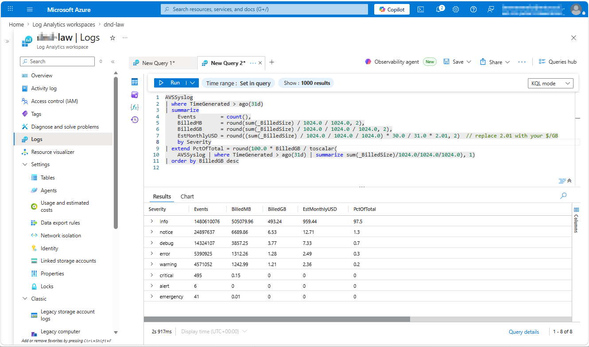
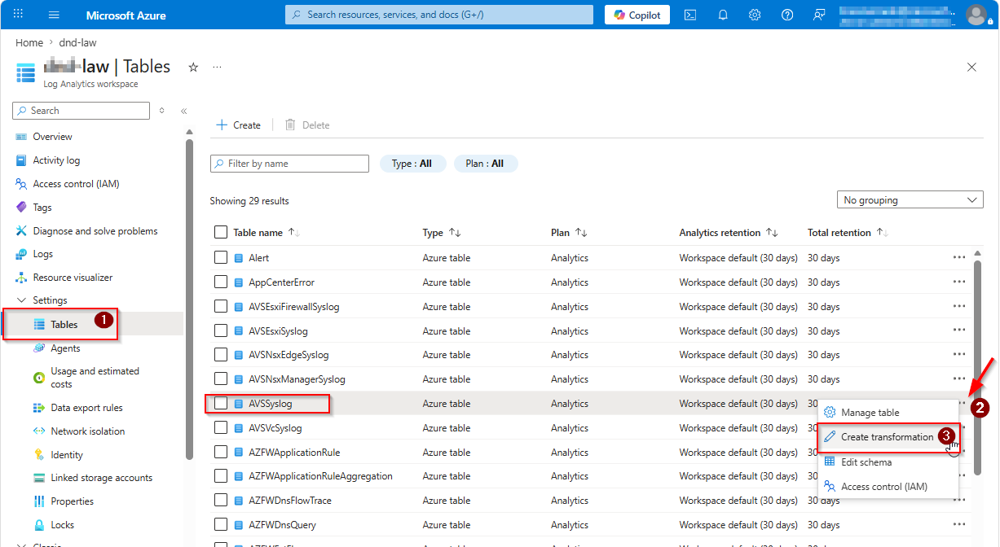
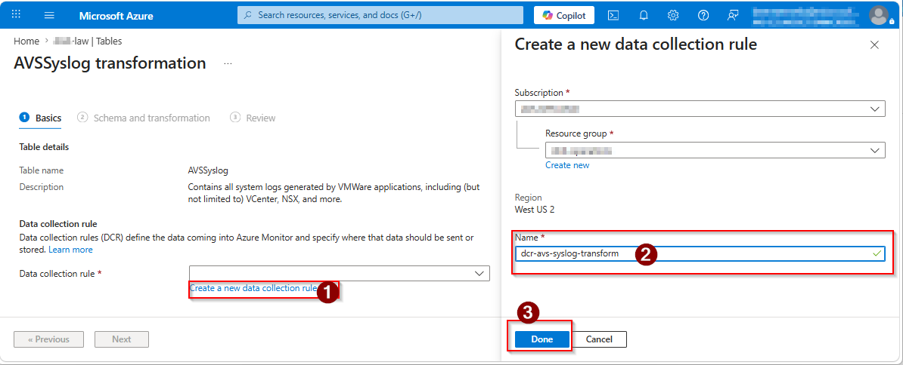
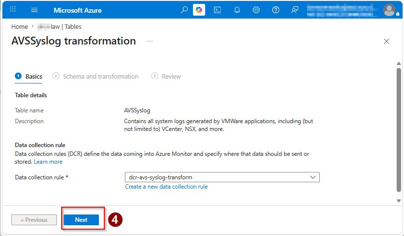
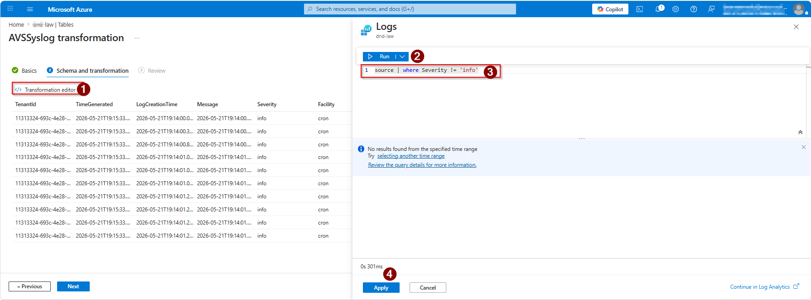
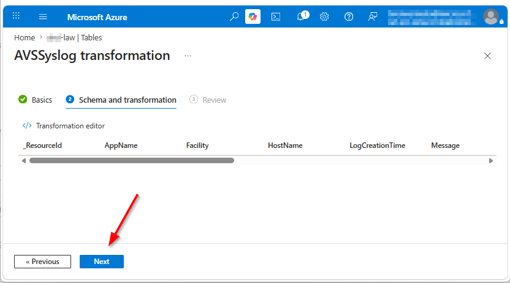
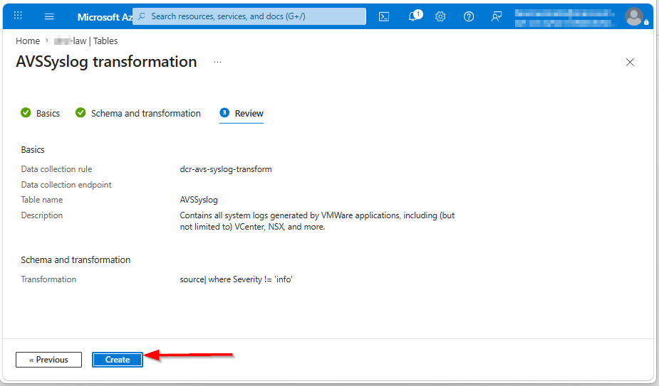
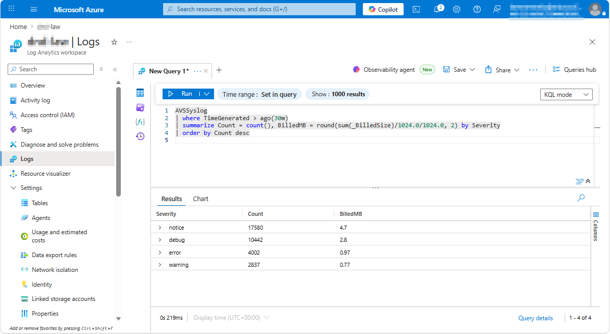

# AVSSyslog Cost Reduction Guide

Reduce Log Analytics ingestion cost for Azure VMware Solution by attaching a workspace transformation DCR.

- **Audience:** Any Azure VMware Solution customer ingesting `AVSSyslog` into Log Analytics
- **Effort:** ~15 minutes (portal-driven, no code)
- **Risk:** Low — reversible, no impact to severities that production queries and alerts typically target

---

## Table of contents

1. [Overview](#overview)
2. [Prerequisites](#prerequisites)
3. [Step 1 — Baseline the cost](#step-1--baseline-the-cost)
4. [Step 2 — Open the AVSSyslog table and start the transformation wizard](#step-2--open-the-avssyslog-table-and-start-the-transformation-wizard)
5. [Step 3 — Create a new Data Collection Rule](#step-3--create-a-new-data-collection-rule)
6. [Step 4 — Confirm the DCR and continue](#step-4--confirm-the-dcr-and-continue)
7. [Step 5 — Enter the transformation](#step-5--enter-the-transformation)
8. [Step 6 — Confirm schema and continue](#step-6--confirm-schema-and-continue)
9. [Step 7 — Review and Create](#step-7--review-and-create)
10. [Step 8 — Wait for propagation](#step-8--wait-for-propagation)
11. [Step 9 — Validate (after ~30 minutes)](#step-9--validate-after-30-minutes)
12. [Step 10 — Confirm savings (after ~24 hours)](#step-10--confirm-savings-after-24-hours)
13. [Worked example — applying the math to Figure 1](#worked-example--applying-the-math-to-figure-1)
14. [Rollback](#rollback)
15. [FAQ](#frequently-asked-questions)
16. [References](#references)

---

## Overview

Azure VMware Solution (AVS) emits a high volume of syslog records to Log Analytics. On a typical cluster, more than 95% of that volume is informational (`Severity = 'info'`) — records that are rarely queried, almost never alerted on, and largely consist of routine heartbeat and status messages. This guide shows how to drop those informational records before they are billed by attaching a workspace transformation Data Collection Rule (DCR) to your Log Analytics workspace.

### What you will do

- Confirm the cost-saving opportunity by querying severity breakdown over the last 31 days
- Create a new workspace transformation DCR through the Azure Portal
- Apply a one-line KQL transformation that drops `Severity = 'info'` records
- Validate after propagation and confirm cost reduction

### What this does NOT change

- The AVS Diagnostic Setting stays in place — no changes there
- Any query, workbook, dashboard, or alert rule that targets Severity 0–3 (emerg / alert / crit / err) continues to work unchanged
- Historical data already in the table is unaffected — only new records arriving after the transformation is applied are filtered

> **Heads up.** Before you proceed, do a quick inventory: search your workspace for saved queries, workbooks, and alert rules that reference `'info'` explicitly (for example KQL containing `Severity == 'info'` or `Severity in ('info', ...)`). If any exist and you depend on them, adjust the transformation in Step 5 accordingly — or exclude those specific message patterns instead of dropping the whole severity.

### How the cost math works

Workspace transformations run before the ingestion billing meter, so dropped records cost nothing. There is one caveat: if a transformation drops more than 50% of the incoming volume, Microsoft applies a data-processing charge — you are billed for the portion dropped above the 50% threshold. The official formula is:

> **charge = (GB dropped) − (GB incoming ÷ 2)**

In practice this means the maximum achievable saving on a single table via transformation is approximately 50% of the original ingestion cost. For AVS clusters where `'info'` represents 90%+ of the data, you will reach this floor.

> **Exception — Microsoft Sentinel:** If Microsoft Sentinel is **already enabled** on the Log Analytics workspace (for SIEM/SOAR reasons), transformations to Analytics tables are **not subject** to the 50% filtering charge, regardless of how much data the transformation filters. The exemption is a free perk for existing Sentinel workspaces — do not enable Sentinel just to get it (Sentinel's own per-GB analysis charge applies to every table in the workspace and typically far exceeds any filtering-charge saving).

See also: [Microsoft Learn — Cost for transformations (Analytics or Basic Logs)](https://learn.microsoft.com/azure/azure-monitor/data-collection/data-collection-transformations#analytics-or-basic-logs)

---

## Prerequisites

- Azure Log Analytics workspace receiving `AVSSyslog` data
- `AVSSyslog` table plan = **Analytics** (default; check **Tables → AVSSyslog → Plan** column)
- Permission: **Monitoring Contributor** (or Contributor) on the workspace's resource group
- The DCR must be created in the **same Azure region** as your Log Analytics workspace

---

## Step 1 — Baseline the cost

Before changing anything, run this query in your workspace to see how much of your `AVSSyslog` volume is `'info'` and confirm the opportunity is worth pursuing. In the Azure Portal, open your Log Analytics workspace → **Logs**, then paste:

```kql
AVSSyslog
| where TimeGenerated > ago(31d)
| summarize
    Events        = count(),
    BilledMB      = round(sum(_BilledSize) / 1024.0 / 1024.0, 2),
    BilledGB      = round(sum(_BilledSize) / 1024.0 / 1024.0 / 1024.0, 2),
    EstMonthlyUSD = round((sum(_BilledSize) / 1024.0 / 1024.0 / 1024.0) * 30.0 / 31.0 * 2.01, 2)  // replace 2.01 with your $/GB
    by Severity
| extend PctOfTotal = round(100.0 * BilledGB / toscalar(
    AVSSyslog | where TimeGenerated > ago(31d) | summarize sum(_BilledSize)/1024.0/1024.0/1024.0), 1)
| order by BilledGB desc
```

Click **Run**. You should see a breakdown similar to the example below — note the share of `'info'` versus all other severities, and the projected monthly cost per severity.


*Figure 1 — Severity breakdown over the last 31 days. In this example `'info'` represents 97.5% of billed volume.*

> **Tip.** If `'info'` is ≥ 50% of total billed volume, dropping it will get you to the maximum possible savings on this table (the ~50% filtering-tax floor).
>
> If the query returns no rows, check **Tables → AVSSyslog → Manage table** and ensure the interactive retention is ≥ 31 days. Shorten the window to `ago(7d)` if needed.

---

## Step 2 — Open the AVSSyslog table and start the transformation wizard

1. In the Azure Portal, open your Log Analytics workspace.
2. In the left blade, under **Settings**, select **Tables**.
3. Locate `AVSSyslog` in the table list. Confirm **Plan = Analytics**.
4. Click the **...** (more) menu at the right end of the `AVSSyslog` row → select **Create transformation**.


*Figure 2 — From the workspace's Tables blade, open the `AVSSyslog` row menu and choose **Create transformation**.*

> **If Create transformation is greyed out**, the table plan is not Analytics. Switch the plan via **Manage table** first.

See also: [Microsoft Learn — Add a transformation to a workspace DCR (Azure Portal tutorial)](https://learn.microsoft.com/azure/azure-monitor/logs/tutorial-workspace-transformations-portal)

---

## Step 3 — Create a new Data Collection Rule

The **Basics** tab of the wizard asks which DCR to attach the transformation to. The first time you do this for a workspace, you must create a new DCR.

1. On the **Data collection rule** dropdown, click the **Create a new data collection rule** link.
2. In the panel that appears:
   - **Subscription:** same subscription as the workspace
   - **Resource group:** same resource group as the workspace (or your dedicated monitoring resource group)
   - **Region:** pre-filled to match the workspace — must not be changed
   - **Name:** a descriptive name such as `dcr-avs-syslog-transform`
3. Click **Done**.


*Figure 3 — Create a new data collection rule. Use a clear naming convention; the region is fixed to match the workspace.*

---

## Step 4 — Confirm the DCR and continue

The **Basics** tab now shows the newly-created DCR selected. Click **Next** to advance to the **Schema and transformation** tab.


*Figure 4 — DCR populated in the Basics tab. Click **Next** to proceed.*

---

## Step 5 — Enter the transformation

1. On the **Schema and transformation** tab, click **Transformation editor** at the top of the sample data grid.
2. A right-hand pane opens with a KQL editor. The input stream is always called `source`. Paste the following one-line transformation:

   ```kql
   source | where Severity != 'info'
   ```

3. Click **Run** to preview what the transformation would drop against a recent sample.
4. When you are satisfied with the preview, click **Apply** at the bottom of the pane.


*Figure 5 — Transformation editor with the one-line filter. The left grid shows the sample input; the right pane shows the output after the transformation.*

> **Preview returning "No results found from the specified time range" is EXPECTED behavior.** The editor pulls a small recent sample and on AVS clusters that sample is almost always 100% `Severity = 'info'`. Your transformation drops all of them → preview shows no output → which is exactly the desired behavior.
>
> To see a more varied sample, widen the time range using the picker at the top of the right-hand Logs pane (e.g. **Last 4 hours**).

> **Optional — drop `'notice'` and `'debug'` as well** (no additional saving since you are already at the 50% floor, but cleans up low-value noise):
>
> ```kql
> source | where Severity !in ('info', 'notice', 'debug')
> ```

See also: [Microsoft Learn — Structure of a transformation in a data collection rule (supported KQL operators)](https://learn.microsoft.com/azure/azure-monitor/essentials/data-collection-transformations-structure)

---

## Step 6 — Confirm schema and continue

After **Apply**, the schema preview reflects the same columns (your transformation does not change schema, only filters rows). Click **Next** to proceed to **Review**.


*Figure 6 — Schema preview after applying the transformation. Click **Next**.*

---

## Step 7 — Review and Create

On the **Review** tab, verify:

- **Data collection rule:** the name you chose in Step 3
- **Table name:** `AVSSyslog`
- **Transformation:** `source | where Severity != 'info'`

Click **Create** to deploy the DCR.


*Figure 7 — Final review screen. Click **Create** to deploy.*

---

## Step 8 — Wait for propagation

The new DCR is attached to the workspace's `defaultDataCollectionRuleResourceId` and picked up by the platform-managed DCR that feeds `AVSSyslog`. Allow approximately **10–15 minutes** before validating.

> Records that were ingested before the transformation took effect are unchanged. Historical queries continue to see all severities. Only NEW arriving records are filtered.

---

## Step 9 — Validate (after ~30 minutes)

Run this query in **Logs** to confirm the filter is in effect:

```kql
AVSSyslog
| where TimeGenerated > ago(30m)
| summarize Count = count(), BilledMB = round(sum(_BilledSize)/1024.0/1024.0, 2) by Severity
| order by Count desc
```

Expected: zero or near-zero rows with `Severity = 'info'`. A small residual count during the propagation window is normal.


*Figure 8 — Validation query after ~30 minutes. The `'info'` row is gone (or near-zero); remaining severities continue to ingest normally.*

---

## Step 10 — Confirm savings (after ~24 hours)

After a full day of filtered ingestion, project the new monthly run-rate. Adjust the per-GB price below to match your region's Pay-As-You-Go rate for the Analytics tier (or your commitment tier rate).

```kql
AVSSyslog
| where TimeGenerated > ago(24h)
| summarize BilledGB_24h = round(sum(_BilledSize)/1024.0/1024.0/1024.0, 2)
| extend ProjectedMonthlyCost_USD = round(BilledGB_24h * 30 * 2.01, 2)  // replace 2.01 with your $/GB
```

Compare against your pre-change monthly cost. For clusters where `'info'` was ≥ 50% of volume, expect the projected cost to land at approximately 50% of the original — the filtering-tax floor.

---

## Worked example — applying the math to Figure 1

For context, here is the same Step 1 baseline alongside the dollar math, so you can compare your post-change numbers against what the transformation should produce.


*Figure 1 (repeat) — Severity breakdown over the last 31 days. In this example `'info'` represents 97.5% of billed volume.*

Using the numbers from Figure 1 (31-day window, $2.01 / GB Pay-As-You-Go) to make the cost math concrete:

- **Pre-change monthly cost:** ~506 GB ingested in 31 days → ~490 GB/month → 490 × $2.01 ≈ **$984 / month**.
- **`'info'` share:** 493 GB / 31d ≈ 477 GB/month (97.5% of incoming).

### Cost math (standard workspace, no Sentinel)

The 50% filtering charge applies. Microsoft bills you for whatever you drop above 50% of incoming:

```
Incoming (monthly)         = 490 GB
50% threshold              = 245 GB    (free to drop)
Dropped by transformation  = 477 GB    (the 'info' rows)
Over-threshold drop        = 477 - 245 = 232 GB    ← billed at $2.01/GB

Filtering charge           = 232 × $2.01 = $466 / month
Ingestion (remaining 13 GB)= 13 × $2.01  = $26  / month
─────────────────────────────────────────────────────────
New monthly bill           ≈ $492 / month
Savings vs. $984           ≈ $492 / month  (≈ 50%)
```

> **This is the ~50% floor in action:** no matter how aggressively you filter a single table, the most you can save on a non-Sentinel workspace is roughly half the original cost.

> **Already running Microsoft Sentinel on this workspace?** The transformation still applies and the `AVSSyslog` line drops the same ~95–97%, but the Sentinel per-GB surcharge on every other table is unaffected — enabling Sentinel is not itself a cost-reduction step. See [Microsoft Sentinel billing](https://learn.microsoft.com/azure/sentinel/billing).

> Numbers are rounded for readability. Replace $2.01 / GB with your region's PAYG or commitment-tier effective rate for a precise figure.

---

## Rollback

If you ever need to restore full ingestion (for example, during a post-incident investigation):

1. Workspace → **Tables → AVSSyslog → ... → Edit transformation**.
2. Change the KQL to:

   ```kql
   source
   ```

3. Click **Apply → Save**.

Propagation takes another ~10–15 minutes; new records arriving after that point will include all severities again.

> Records dropped before rollback **cannot be recovered** — they were never ingested. If you anticipate needing rich historical `'info'` data, consider routing `AVSSyslog` to a low-cost Basic Logs table or to a Storage Account instead of full Analytics ingestion.

---

## Frequently asked questions

### Will this affect my existing queries, workbooks, or dashboards?

Only if any of them explicitly query `Severity = 'info'`. Queries that filter on Severity 0–3 (emerg / alert / crit / err) or higher severities are unaffected. Severity-distribution charts will simply no longer show an `'info'` slice for new time ranges — a cosmetic change. Historical time ranges still show `'info'` because records ingested before the transformation took effect are untouched.

### Will this affect my alert rules?

Only if any rule fires on `Severity = 'info'` records. Most operational alerts target Severity 0–2 (emergency / alert / critical) or specific Message patterns within higher-severity records, so they are unaffected. Audit your rules before applying the transformation if you are unsure.

### Can I split the transformation across multiple rules to bypass the 50% filtering charge?

No. The 50% filtering threshold is measured against the **net drop rate** of the data flow into the table, not per-rule. Splitting filters across multiple transformations or DCRs does not bypass it. The one documented exception is workspaces with Microsoft Sentinel enabled — transformations to Analytics tables are exempt from the filtering charge.

### Could I just disable the Diagnostic Setting instead?

Disabling the Diagnostic Setting stops **all** `AVSSyslog` data flow, which means you lose visibility into every severity — including the high-severity records that operations and security teams rely on. The workspace transformation approach gives you targeted filtering of `'info'` only, with zero impact on the severities you care about.

### What about switching AVSSyslog to the Basic Logs table plan?

Basic Logs ingestion is significantly cheaper per GB but limits query capability (KQL operator subset), restricts retention, and is incompatible with most scheduled-query alert rules. It can be a valid option for archival or occasional investigation, but not for a table that backs active alerts or dashboards. The transformation approach in this guide preserves full Analytics-tier query and alerting capability.

See also: [Microsoft Learn — Log Analytics table plans (Analytics, Basic, Auxiliary)](https://learn.microsoft.com/azure/azure-monitor/logs/data-platform-logs#table-plans)

---

## References

All links below are official Microsoft Learn or Azure documentation.

### Cost and the 50% filtering threshold

- [Cost for transformations — Analytics or Basic Logs (defines the 50% filtering charge and the Sentinel exception)](https://learn.microsoft.com/azure/azure-monitor/data-collection/data-collection-transformations#analytics-or-basic-logs)
- [Azure Monitor Logs cost calculations and options](https://learn.microsoft.com/azure/azure-monitor/logs/cost-logs)
- [Azure Monitor pricing](https://azure.microsoft.com/pricing/details/monitor/)

### Workspace transformations

- [Data collection transformations in Azure Monitor (overview)](https://learn.microsoft.com/azure/azure-monitor/essentials/data-collection-transformations)
- [Workspace transformation DCR](https://learn.microsoft.com/azure/azure-monitor/essentials/data-collection-transformations-workspace)
- [Add a transformation to a workspace DCR — Azure Portal tutorial](https://learn.microsoft.com/azure/azure-monitor/logs/tutorial-workspace-transformations-portal)
- [Structure of a transformation in a data collection rule (KQL subset and the `source` stream)](https://learn.microsoft.com/azure/azure-monitor/essentials/data-collection-transformations-structure)

### Log Analytics platform

- [Log Analytics table plans (Analytics, Basic, Auxiliary)](https://learn.microsoft.com/azure/azure-monitor/logs/data-platform-logs#table-plans)
- [Manage tables in a Log Analytics workspace](https://learn.microsoft.com/azure/azure-monitor/logs/manage-logs-tables)
- [`_BilledSize` and log data size calculation](https://learn.microsoft.com/azure/azure-monitor/logs/cost-logs#data-size-calculation)

### Azure VMware Solution monitoring

- [Configure Azure VMware Solution syslog](https://learn.microsoft.com/azure/azure-vmware/configure-vmware-syslogs)
- [Monitor and protect AVS — workbooks and alerts](https://learn.microsoft.com/azure/azure-vmware/concepts-monitor-protection)
